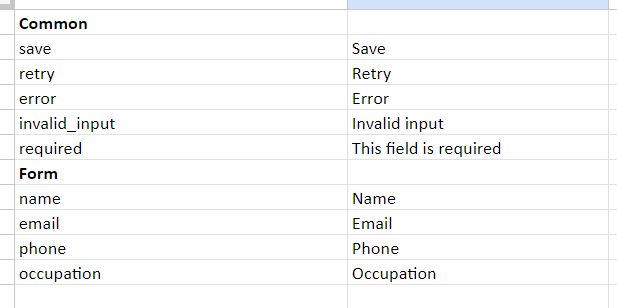
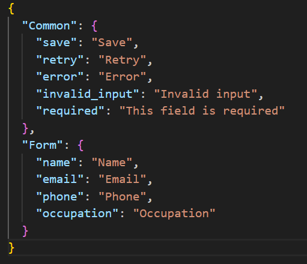

# Excel to Json, Json to Excel

## Description

Conversion from two-column Excel file to two-level JSON and vice versa.



⬇️⬆️



### Use

`pip install pandas`

### Convert simple excel to two-level nested JSON in the following format:

Column A holds keys
Column B holds values

Rows with empty values for column B are parent keys, and the rows until the next parent will be nested inside this key.

#### Function arguments:

`input_excel` - name/ path to input .xlsx  
`output_json` - name of output file  
`sheet_name` - name of sheet  
`start_row` - start row number. Not 0-indexed - use the number that appears in excel file.  
`finish_row` - end row, optional. Default runs till the end of file. Not 0-indexed - use the number that appears in excel file.  
`key_column` - specify column for keys. Default 0, i.e. column A (0-indexed)  
`value_column` - specify column for values. Default 1, i.e. column B (0-indexed)

Specify arguments in the function call and run

```
python to_json.py
```

### Convert two-level Json back to two-column excel.

Converts a two-level JSON back to a two-column excel with keys in column A and values in column B.

#### Function arguments:

`input_json`  
`output_excel`  
`sheet_name` - optional. Default "Sheet 1"  
`start_row`- optional. Default 1 (not 0-indexed)  
`key_column` - optional, zero-indexed. Default 0, i.e. column A  
`value_column` - optional, zero-indexed. Default B, i.e. column B

Specify arguments in the function call and run

```
python to_excel.py
```

### Requirements

- python (3.10.9 was used)
- pandas external package
